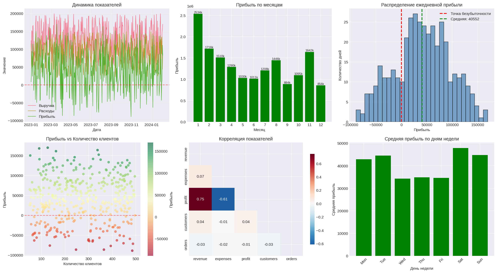

# 📊 Система анализа показателей деятельности организации

Автоматизированная система для загрузки, очистки, анализа и визуализации бизнес-показателей. Самостоятельно выявляет тренды, зависимости, аномалии и формирует готовый аналитический отчет.

## 🎯 Возможности

| Функция | Описание |
|---------|----------|
| 📂 **Загрузка данных** | Поддержка CSV, Excel |
| 🧹 **Очистка данных** | Автоматическое удаление пропусков, дубликатов, обработка выбросов |
| 📐 **Расчет показателей** | Суммы, средние, доли, рентабельность, динамика изменений |
| 📈 **Анализ трендов** | Линейная регрессия, направление и сила тренда для каждого показателя |
| 🔗 **Корреляционный анализ** | Выявление зависимостей между показателями |
| ⚠️ **Обнаружение аномалий** | Поиск выбросов методом IQR |
| 📊 **Визуализация** | 6 автоматических графиков (линейные, столбчатые, диаграммы рассеяния, тепловая карта) |
| 📝 **Формирование отчета** | Полный аналитический отчет с выводами и рекомендациями |
| 📎 **Экспорт** | Сохранение графиков и отчета |

---

## 📸 Результат работы системы

*Ниже представлен пример визуализации, построенной автоматически на основе загруженных данных:*



*На изображении представлены 6 графиков:*
1. *Динамика выручки, расходов и прибыли*
2. *Прибыль по месяцам*
3. *Распределение ежедневной прибыли*
4. *Зависимость прибыли от количества клиентов*
5. *Тепловая карта корреляций*
6. *Средняя прибыль по дням недели*

---

## 🚀 Быстрый старт

### Установка

```bash
# Клонирование репозитория
git clone https://github.com/your-username/business-analysis-system.git
cd business-analysis-system

# Установка зависимостей
pip install pandas numpy matplotlib seaborn scikit-learn openpyxl
